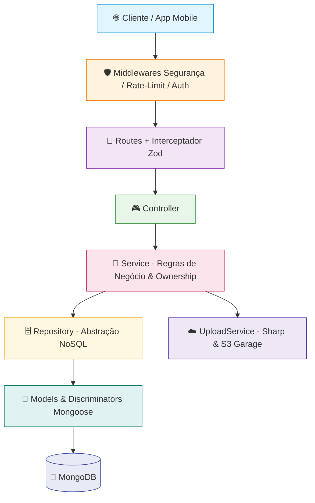

<div align="center">

# 🧾 RotaRDV - Registro de Despesas de Viagens

**API RESTful para Gestão Operacional e Financeira de Frotas Rodoviárias.**

Permite registrar viagens, gerenciar frotas e motoristas, lançar despesas polimórficas detalhadas com anexos em S3 e realizar **sincronização bidirecional resiliente sob o paradigma Offline-First**.


</div>

---

## 📋 Sumário

- [Tecnologias](#-tecnologias)
- [Estrutura do Projeto](#-estrutura-do-projeto)
- [Instalação e Execução](#-instalação-e-execução)
- [Variáveis de Ambiente](#-variáveis-de-ambiente)
- [Scripts npm](#-scripts-npm)
- [Docker](#-docker)
- [Arquitetura da API](#-arquitetura-da-api)
- [Mecanismo de Sincronização Offline-First](#-mecanismo-de-sincronização-offline-first)
- [Catálogo de Endpoints (Rotas da API)](#-catálogo-de-endpoints-rotas-da-api)
- [Usando os Utilitários e Helpers](#-usando-os-utilitários-e-helpers)
- [Convenções do Projeto](#-convenções-do-projeto)
- [Licença](#-licença)

---

## 🛠 Tecnologias

<details open>
<summary><b>Backend & Database</b></summary>

| Tecnologia | Versão | Descrição |
| :--- | :---: | :--- |
|  | 22+ | Runtime JavaScript (ES Modules nativo) |
|  | 5.2 | Web framework minimalista e rápido |
|  | 8+ | Banco de dados orientado a documentos |
|  | 9 | ODM com suporte a Discriminators e Hooks |
| `mongoose-paginate-v2` | 1.9 | Paginação otimizada com metadados estruturados |
|  | 9 | Autenticação stateless (Access, Refresh e Recovery Tokens) |
| `bcryptjs` | 3 | Hash criptográfico unidirecional de senhas |
| `google-auth-library` | 10 | Validação de ID Tokens do Google OAuth2 |
| `@ruanlopes1350/hermes-client` | 1.0 | Cliente HTTP para despache de e-mails transacionais e notificações |

</details>

<details>
<summary><b>Segurança & Validação</b></summary>

| Tecnologia | Descrição |
| :--- | :--- |
|  | Headers HTTP de segurança rigorosos com CSP customizado |
| `cors` | Controle granular de Cross-Origin Resource Sharing |
| `express-rate-limit` | Rate limiting em 3 níveis (auth, strict para login/recover, e public) |
|  | Validação estrita de contratos de entrada (Body, Params, Queries) |
| `cpf-cnpj-validator` | Validação matemática de documentos brasileiros (CPF) |
| `dompurify` + `jsdom` | Sanitização rigorosa de arquivos vetoriais SVG contra ataques XSS |
| `compression` | Compressão gzip automática de payloads HTTP |

</details>

<details>
<summary><b>Armazenamento & Mídia</b></summary>

| Tecnologia | Descrição |
| :--- | :--- |
|  | Armazenamento de alta performance S3-Compatible |
| `express-fileupload` | Middleware de recepção de arquivos multipart (limite de 50MB) |
| `sharp` | Compressão inteligente para JPEG progressivo e redimensionamento |

</details>

<details>
<summary><b>Logging & Observabilidade</b></summary>

| Tecnologia | Descrição |
| :--- | :--- |
|  | Logging estruturado multinível com identificador único `errorId` |
| `winston-daily-rotate-file` | Rotação diária automatizada de logs com política de retenção de 30 dias |
| `swagger-ui-express` | Interface interativa OpenAPI 3.0 para exploração e testes de endpoints |

</details>

---

## 📁 Estrutura do Projeto

A arquitetura do projeto segue o padrão **Layered Architecture** com segregação estrita de responsabilidades:

```
tcc-despesas-api/
├── 📄 server.js                          # Ponto de inicialização do servidor HTTP
├── 📦 package.json                       # Metadados, scripts e dependências
├── 🐳 Dockerfile                         # Configuração de build da imagem de produção
├── 🐳 docker-compose.yml                 # Orquestração do MongoDB e API (Produção)
├── 🐳 docker-compose.dev.yml             # Orquestração com live reload (Desenvolvimento)
├── 🔄 .gitlab-ci.yml                     # Pipeline CI/CD (SAST & Secret Detection)
├── ⚙️ nodemon.json                       # Configuração de hot-reload
├── ⚙️ eslint.config.js                   # Padronização de código ESLint (Flat Config)
├── ⚙️ .prettierrc                        # Regras de formatação Prettier
├── 🔐 .env.example                       # Modelo de variáveis de ambiente
├── 📂 documentacao/                      # Documentações de escopo, modelagem e requisitos
│   ├── escopoProjeto/                    # Projeto, Offline-First e Modelagem de Despesas
│   └── requisitos/                       # Especificação completa de Requisitos (RF/RNF)
│
└── src/
    ├── 🚀 app.js                         # Instanciação do Express e pipeline de middlewares
    │
    ├── ⚙️ config/                        # Conexões e clientes de infraestrutura
    │   ├── dbConnect.js                  # Conexão resiliente com o MongoDB
    │   ├── garageConnect.js              # Cliente S3 (MinIO/Garage)
    │   ├── hermesClient.js               # Cliente de notificações/emails Hermes
    │   └── setupGarage.js                # Provisionamento automático de buckets S3
    │
    ├── 🎮 controllers/                  # Manipuladores de requisições HTTP
    │   ├── AuthController.js             # Login, signup, google, tokens e verificação
    │   ├── DespesaController.js          # Criação, listagem e remoção de despesas
    │   ├── EmpresaController.js          # Gestão corporativa, motoristas, frota e dashboard
    │   ├── SyncController.js             # Push e Pull de sincronização offline-first
    │   ├── UsuarioController.js          # CRUD e gestão de status e fotos de usuários
    │   ├── VeiculoController.js          # CRUD da frota e reboques
    │   └── ViagemController.js           # Ciclo de vida e resumo financeiro de viagens
    │
    ├── 💼 services/                      # Regras de negócio e casos de uso
    │   ├── AuthService.js                # Autenticação, OAuth2, senhas e email
    │   ├── DespesaService.js             # Lançamento polimórfico e validações operacionais
    │   ├── EmpresaService.js             # Regras de governança de empresas, frota e motoristas
    │   ├── SyncService.js                # Motor de reconciliação em lote (bulkWrite)
    │   ├── UploadService.js              # Otimização Sharp, SVG sanitizer e retry S3
    │   ├── UsuarioService.js             # Gestão de permissões e perfis
    │   ├── VeiculoService.js             # Gestão de frota e duplicidades
    │   └── ViagemService.js              # Snapshots imutáveis e cálculo de consumo/totais
    │
    ├── 🗄️ repositories/                  # Abstração de persistência e queries NoSQL
    │   ├── BaseRepository.js             # Repositório genérico com paginação integrada
    │   ├── DespesaRepository.js          # Queries e agregações de despesas
    │   ├── EmpresaRepository.js          # Queries, métricas e agregações da empresa
    │   ├── UploadRepository.js           # Operações diretas no storage S3
    │   ├── UsuarioRepository.js          # Queries com projections e busca por documento
    │   ├── VeiculoRepository.js          # Queries da frota
    │   └── ViagemRepository.js           # Queries de viagens com populated references
    │
    ├── 📝 models/                        # Esquemas Mongoose e Discriminators
    │   ├── Empresa.js                    # Modelo de empresa/transportadora e endereço
    │   ├── Usuario.js                    # Modelo de usuário com credenciais e status
    │   ├── Veiculo.js                    # Modelo de veículo e conjunto de reboques
    │   ├── Viagem.js                     # Modelo de viagem com snapshots imutáveis (UUID)
    │   ├── Despesa.js                    # Modelo base polimórfico de despesa (UUID)
    │   ├── DespesaAbastecimento.js       # Discriminator ABASTECIMENTO (litros, KM, combustível)
    │   ├── DespesaAlimentacao.js         # Discriminator ALIMENTACAO (tipo de refeição)
    │   ├── DespesaManutencao.js          # Discriminator MANUTENCAO (oficina mecânica)
    │   └── DespesaPedagio.js             # Discriminator PEDAGIO (praça de pedágio)
    │
    ├── 🎯 routes/                        # Definição e roteamento de endpoints
    │   ├── index.js                      # Agregador central de rotas, docs e health
    │   ├── authRoutes.js                 # Rotas públicas e sensíveis de autenticação
    │   ├── despesaRoutes.js              # Rotas de gestão de despesas
    │   ├── empresaRoutes.js              # Rotas de gestão de empresas e dashboard
    │   ├── syncRoutes.js                 # Rotas do Sync Engine (push e pull)
    │   ├── usuarioRoutes.js              # Rotas de gestão de usuários
    │   ├── veiculoRoutes.js              # Rotas de gestão de veículos
    │   └── viagemRoutes.js               # Rotas de controle de viagens
    │
    ├── 🛡️ middlewares/                   # Interceptadores de requisições
    │   ├── AuthMiddleware.js             # Validação de JWT Bearer e sessão ativa
    │   ├── LogRoutesMiddleware.js        # Log em tempo real de tráfego de rotas
    │   ├── RateLimitMiddleware.js        # Limitadores de requisições por IP
    │   └── asyncWrapper.js               # Envelopador assíncrono para captura de exceções
    │
    ├── 🌱 seeds/                         # Povoamento inicial de banco de dados
    │   ├── seeds.js                      # Orquestrador central dos seeds
    │   ├── seedsUsuario.js               # Injeção de usuários admin e motoristas padrão
    │   ├── seedsVeiculo.js               # Injeção de caminhões e carretas
    │   ├── seedsViagem.js                # Injeção de viagens de teste
    │   └── seedsDespesa.js               # Injeção de despesas polimórficas de teste
    │
    ├── 📚 docs/                          # Especificação OpenAPI / Swagger UI
    │   ├── config/head.js                # Metadados e configuração do Swagger
    │   ├── paths/                        # Documentação modular por rota
    │   └── schemas/                      # Esquemas de entrada e saída documentados
    │
    └── 💡 utils/                         # Utilitários, helpers e validações
        ├── AuthHelper.js                 # Utilitário de hash e comparação de senhas
        ├── TokenUtil.js                  # Gerenciador de ciclo de vida de tokens JWT
        ├── logger.js                     # Configuração Winston com rotação de arquivos
        ├── helpers/                      # Helpers de resposta, erro e plugins de data
        └── validators/schemas/zod/       # Schemas Zod de validação em tempo de execução
```

---

## 🚀 Instalação e Execução

### Pré-requisitos

* **Node.js**: v22.0.0 ou superior
* **MongoDB**: v8.0 ou superior (ou via Docker)
* **Docker & Docker Compose** *(opcional, mas recomendado)*

### 1. Clonar e Instalar Dependências

```bash
git clone https://gitlab.fslab.dev/tcc-registro-de-despesas-luis/tcc-despesas-api.git
cd tcc-despesas-api
npm install
```

### 2. Configurar o Ambiente

```bash
cp .env.example .env
```
Edite o arquivo `.env` preenchendo as chaves secretas de JWT, credenciais do MongoDB, Storage S3 (Garage/MinIO), Hermes Client e Google OAuth.

### 3. Execução em Modo de Desenvolvimento

**Com Docker Compose (Recomendado):**
```bash
npm run dev
```

**Localmente (Node.js nativo com Nodemon):**
```bash
npm run dev:local
```

### 4. Povoar o Banco de Dados com Dados Iniciais (Seeds)

```bash
# Se estiver executando com Docker
npm run seed

# Se estiver executando localmente
npm run seed:local
```

### 5. Acessar a Documentação Interativa

Com o servidor rodando, acesse no navegador:
👉 **[http://localhost:5040/docs](http://localhost:5040/docs)** (ou na porta configurada em `API_PORT`).

---

## 🔐 Variáveis de Ambiente

<details open>
<summary><b>🗄️ Banco de Dados & Aplicação</b></summary>

| Variável | Descrição | Exemplo |
| :--- | :--- | :--- |
| `DB_URL` | URI de conexão com o MongoDB | `mongodb://localhost:27017/appDespesas` |
| `API_PORT` | Porta de escuta da API HTTP | `5040` |
| `NODE_ENV` | Ambiente de execução (`development` / `production`) | `development` |
| `DEBUGLOG` | Habilita logs detalhados de requisições no console | `true` |
| `SALT_LENGTH` | Fator de custo do algoritmo bcrypt para senhas | `10` |

</details>

<details>
<summary><b>🔑 Segurança e Autenticação (JWT & Google)</b></summary>

| Variável | Descrição | Padrão / Exemplo |
| :--- | :--- | :--- |
| `JWT_SECRET_ACCESS_TOKEN` | Segredo de assinatura do Access Token (mín. 32 caracteres) | `segredo_super_seguro_access_jwt_32c` |
| `JWT_SECRET_REFRESH_TOKEN` | Segredo de assinatura do Refresh Token (mín. 32 caracteres) | `segredo_super_seguro_refresh_jwt_32` |
| `JWT_SECRET_PASSWORD_RECOVERY` | Segredo para tokens de recuperação de senha | `segredo_super_seguro_recupera_jwt32` |
| `JWT_ACCESS_TOKEN_EXPIRATION` | Tempo de vida do Access Token | `2m` |
| `JWT_REFRESH_TOKEN_EXPIRATION` | Tempo de vida do Refresh Token | `3d` |
| `JWT_PASSWORD_RECOVERY_EXPIRATION`| Tempo de vida do token de recuperação | `1h` |
| `SINGLE_SESSION_REFRESH_TOKEN` | Força expiração do refresh token a cada renovação | `false` |
| `GOOGLE_CLIENT_ID` | Client ID do Google OAuth2 para autenticação federada | `seu-client-id.apps.googleusercontent.com` |
| `GOOGLE_CLIENT_SECRET` | Client Secret do Google OAuth2 | `seu-client-secret` |

</details>

<details>
<summary><b>☁️ Armazenamento S3 (MinIO / Garage)</b></summary>

| Variável | Descrição | Exemplo |
| :--- | :--- | :--- |
| `GARAGE_ENDPOINT` | Hostname do servidor S3 (sem http/https) | `localhost` |
| `GARAGE_PORT` | Porta do servidor S3 | `9000` |
| `GARAGE_USE_SSL` | Indica se utiliza conexão SSL/TLS | `false` |
| `GARAGE_PUBLIC_URL` | URL base pública de acesso às imagens | `http://localhost:9000` |
| `GARAGE_ACCESS_KEY` | Access Key do S3 | `garage_access_key` |
| `GARAGE_SECRET_KEY` | Secret Key do S3 | `garage_secret_key` |
| `GARAGE_BUCKET_FOTOS` | Nome do bucket para fotos e comprovantes | `rotardv-fotos` |

</details>

<details>
<summary><b>📧 Notificações & Emails (Hermes Client)</b></summary>

| Variável | Descrição | Exemplo |
| :--- | :--- | :--- |
| `HERMES_API_KEY` | Chave de API para despacho de emails via Hermes | `hermes_chave_secreta` |
| `HERMES_BASE_URL` | URL base do microserviço Hermes | `https://api.hermes.qa.fslab.dev` |
| `API_BASE_URL` | URL base pública da própria API para links de verificação | `http://localhost:5040` |

</details>

---

## 📜 Scripts npm

| Script | Comando | Descrição |
| :--- | :--- | :--- |
| `npm run dev` | `docker compose -f docker-compose.dev.yml up --build --force-recreate` | Inicia ambiente de desenvolvimento completo no Docker com Hot-Reload |
| `npm run dev:local` | `npx nodemon server.js` | Inicia a API localmente com recarregamento automático |
| `npm run start` | `docker compose -f docker-compose.yml up --build` | Inicia o stack de produção em containers isolados |
| `npm run start:local` | `node server.js` | Inicia a API diretamente com Node.js |
| `npm run seed` | `docker exec -it api-despesas node src/seeds/seeds.js` | Executa a população de dados de teste dentro do container Docker |
| `npm run seed:local` | `node src/seeds/seeds.js` | Executa o seed diretamente no banco local configurado |
| `npm test` | `jest --coverage --detectOpenHandles` | Executa a suíte de testes com relatório de cobertura |
| `npm run lint` | `eslint .` | Analisa a conformidade do código com as regras de Linting |
| `npm run lint:fix` | `eslint . --fix` | Corrige automaticamente inconsistências de estilo e sintaxe |
| `npm run format` | `prettier --write .` | Formata todos os arquivos do projeto segundo o `.prettierrc` |

---

## 🏗 Arquitetura da API

### Fluxo de Requisição em Camadas



### Modelagem Polimórfica de Despesas (Single Collection Inheritance)

Para viabilizar consultas unificadas de despesas por viagem sem degradação de desempenho por múltiplos *joins*, a API adota **Mongoose Discriminators** na coleção `despesas`:

* **Esquema Base (`Despesa`):** `_id` (UUID), `viagem_id` (UUID), `tipo`, `valor_total`, `data`, `local`, `descricao`, `foto_anexo`, `createdAt`, `updatedAt`.
* **Sub-esquema `ABASTECIMENTO`:** `litros`, `valor_litro`, `tipo_combustivel`, `km_atual`.
* **Sub-esquema `ALIMENTACAO`:** `tipo_refeicao` (café, almoço, jantar, etc.).
* **Sub-esquema `MANUTENCAO`:** `oficina_nome`.
* **Sub-esquema `PEDAGIO`:** `praca_nome`.
* **Sub-esquema `OUTROS`:** Campos herdados do esquema base.

---

## 🔄 Mecanismo de Sincronização Offline-First

O sistema foi arquitetado para operar em cenários de conectividade instável ou inexistente nas rodovias brasileiras:

1. **Geração Distribuída de Identificadores (UUID v4):** Tanto as viagens quanto as despesas têm seus identificadores `_id` gerados como strings UUID v4 no aplicativo móvel. Isso garante que múltiplos registros criados offline nunca gerem conflito de chave primária ao sincronizar.
2. **Push Sync em Lote (`POST /sync/push`):**
   * Processa arrays de `viagens` e `despesas` em uma única requisição.
   * Utiliza a operação `bulkWrite` do MongoDB com `{ ordered: false }` para que falhas pontuais não interrompam os demais registros.
   * Realiza **Upsert** automático (criação se novo, atualização se existente) e **Deleção Lógica** quando o registro contém `is_deleted: true`.
   * Aplica travas rígidas de **Ownership**: o motorista só sincroniza registros vinculados à sua própria conta.
3. **Pull / Delta Sync Incremental (`GET /sync/pull?updatedAfter=...`):**
   * O aplicativo envia o timestamp da última sincronização bem-sucedida.
   * A API retorna exclusivamente os registros criados ou modificados após essa data, economizando banda de rede e processamento no dispositivo.
4. **Resumo Financeiro On-the-Fly:**
   * Em vez de totalizadores estáticos gravados na viagem sujeitos a inconsistências de concorrência durante sincronizações assíncronas, a API recalcula os totais e médias de consumo (`km/l`) dinamicamente via MongoDB Aggregation Pipeline no momento da consulta.

---

## 📡 Catálogo de Endpoints (Rotas da API)

### 🔐 1. Autenticação (`/`)

| Método | Endpoint | Protegido | Descrição |
| :---: | :--- | :---: | :--- |
| `POST` | `/signup` | Não | Cadastro público de novos motoristas |
| `POST` | `/login` | Não | Login com e-mail e senha (gera Access & Refresh Token) |
| `POST` | `/logout` | Não | Encerra a sessão e revoga o Refresh Token |
| `POST` | `/refresh` | Não | Emite novo Access Token a partir do Refresh Token |
| `POST` | `/google` | Não | Autenticação federada com Google OAuth2 Token |
| `GET` | `/verificar-email` | Não | Valida o token de confirmação de e-mail |
| `POST` | `/recover` | Não | Solicita código de 6 dígitos para recuperação de senha |
| `PATCH` | `/password/reset` | Não | Redefine a senha informando o código recebido |

### 👤 2. Gestão de Usuários (`/usuarios`)

| Método | Endpoint | Protegido | Perfil | Descrição |
| :---: | :--- | :---: | :---: | :--- |
| `GET` | `/usuarios` | Sim | Admin | Lista usuários com paginação e filtros |
| `GET` | `/usuarios/:id` | Sim | Dono / Admin | Retorna dados cadastrais do usuário |
| `POST` | `/usuarios` | Sim | Admin | Criação administrativa de usuário |
| `PATCH` | `/usuarios/:id` | Sim | Dono / Admin | Atualização de dados cadastrais |
| `PATCH` | `/usuarios/:id/status` | Sim | Admin | Altera status entre `ativo` e `inativo` |
| `DELETE` | `/usuarios/:id` | Sim | Admin | Exclusão de usuário do sistema |
| `POST` | `/usuarios/:id/foto` | Sim | Dono / Admin | Upload ou substituição de foto de perfil |
| `DELETE` | `/usuarios/:id/foto` | Sim | Dono / Admin | Remoção da foto de perfil |

### 🏢 3. Gestão de Empresas (`/empresas`)

| Método | Endpoint | Protegido | Perfil | Descrição |
| :---: | :--- | :---: | :---: | :--- |
| `GET` | `/empresas` | Sim | Admin | Lista todas as empresas com paginação e filtros |
| `GET` | `/empresas/:id` | Sim | Dono / Admin | Consulta detalhes e configurações da empresa |
| `POST` | `/empresas` | Sim | Admin | Cadastro corporativo de nova transportadora |
| `PATCH` | `/empresas/:id` | Sim | Gestor / Admin | Atualização parcial de dados cadastrais e endereço |
| `PATCH` | `/empresas/:id/status` | Sim | Admin | Altera status entre `ativo` e `inativo` |
| `DELETE` | `/empresas/:id` | Sim | Admin | Exclusão de empresa (com trava de motoristas/frota vinculada) |
| `GET` | `/empresas/:id/motoristas` | Sim | Gestor / Admin | Lista motoristas vinculados à transportadora |
| `POST` | `/empresas/:id/motoristas` | Sim | Gestor / Admin | Cadastra novo motorista e vincula à empresa |
| `POST` | `/empresas/:id/motoristas/vincular` | Sim | Gestor / Admin | Vincula motorista existente por ID, e-mail ou CPF |
| `DELETE` | `/empresas/:id/motoristas/:motoristaId` | Sim | Gestor / Admin | Desvincula motorista da empresa |
| `GET` | `/empresas/:id/veiculos` | Sim | Gestor / Admin | Lista veículos pertencentes à frota da empresa |
| `GET` | `/empresas/:id/viagens` | Sim | Gestor / Admin | Lista viagens realizadas pela equipe de condutores |
| `GET` | `/empresas/:id/dashboard` | Sim | Gestor / Admin | Métricas executivas consolidadas para o Painel Web |
| `POST` | `/empresas/:id/foto` | Sim | Gestor / Admin | Upload ou substituição de logotipo da empresa |
| `DELETE` | `/empresas/:id/foto` | Sim | Gestor / Admin | Remoção do logotipo da empresa |

### 🚛 4. Gestão de Frota (`/veiculos`)

| Método | Endpoint | Protegido | Perfil | Descrição |
| :---: | :--- | :---: | :---: | :--- |
| `GET` | `/veiculos` | Sim | Qualquer | Lista veículos da frota com paginação |
| `GET` | `/veiculos/:id` | Sim | Qualquer | Detalhes do veículo e reboques engatados |
| `POST` | `/veiculos` | Sim | Admin | Cadastro de veículo de tração e conjunto |
| `PATCH` | `/veiculos/:id` | Sim | Admin | Atualização dos dados do veículo |
| `DELETE` | `/veiculos/:id` | Sim | Admin | Exclusão de veículo da frota |

### 🛣️ 5. Controle de Viagens (`/viagens`)

| Método | Endpoint | Protegido | Perfil | Descrição |
| :---: | :--- | :---: | :---: | :--- |
| `GET` | `/viagens` | Sim | Dono / Admin | Lista viagens (filtradas automaticamente por motorista) |
| `GET` | `/viagens/:id` | Sim | Dono / Admin | Detalhes da viagem com injeção do **Resumo Financeiro** |
| `POST` | `/viagens` | Sim | Dono / Admin | Inicia nova viagem e grava snapshots imutáveis |
| `PATCH` | `/viagens/:id` | Sim | Dono / Admin | Atualiza dados ou encerra a viagem (`concluída`) |
| `DELETE` | `/viagens/:id` | Sim | Dono / Admin | Remove o registro da viagem |

### 🧾 6. Gestão de Despesas (`/despesas`)

| Método | Endpoint | Protegido | Perfil | Descrição |
| :---: | :--- | :---: | :---: | :--- |
| `GET` | `/despesas` | Sim | Dono / Admin | Lista despesas paginadas com filtro por `viagem_id` |
| `GET` | `/despesas/:id` | Sim | Dono / Admin | Consulta os detalhes de uma despesa específica |
| `POST` | `/despesas` | Sim | Dono / Admin | Lança despesa polimórfica em viagem em andamento |
| `DELETE` | `/despesas/:id` | Sim | Dono / Admin | Remove despesa de viagem em andamento |

### 🔄 7. Motor de Sincronização Offline-First (`/sync`)

| Método | Endpoint | Protegido | Perfil | Descrição |
| :---: | :--- | :---: | :---: | :--- |
| `POST` | `/sync/push` | Sim | Motorista | Envio em lote de viagens e despesas (Upsert/Delete) |
| `GET` | `/sync/pull` | Sim | Motorista | Download delta de viagens e despesas atualizadas |

### 🩺 8. Saúde & Documentação

| Método | Endpoint | Protegido | Descrição |
| :---: | :--- | :---: | :--- |
| `GET` | `/health` | Não | Relatório de status da API e conexão do MongoDB |
| `GET` | `/docs` | Não | Interface visual interativa Swagger UI |

---

## 💡 Usando os Utilitários e Helpers

<details>
<summary><b>📤 Respostas Padronizadas (CommonResponse)</b></summary>

```javascript
import { CommonResponse } from './utils/helpers/index.js';

// Sucesso 200 OK
CommonResponse.success(res, { usuario }, 200, 'Usuário recuperado com sucesso.');

// Criação 201 Created
CommonResponse.created(res, { viagem }, 'Viagem iniciada com sucesso.');

// Erro Padronizado
CommonResponse.error(res, 400, 'validationError', 'email', [{ message: 'E-mail inválido.' }]);
```

</details>

<details>
<summary><b>🛡️ Verificação de Permissão Contextual (ensurePermission)</b></summary>

```javascript
import { ensurePermission } from './utils/helpers/index.js';

// Valida se o usuário logado é o proprietário do recurso ou Administrador
ensurePermission({
    usuarioLogado: req.user,
    isOwner: String(viagem.usuario_id) === String(req.user._id),
    field: 'Viagem',
    customMessage: 'Você não tem permissão para alterar esta viagem.'
});
```

</details>

<details>
<summary><b>🚨 Erros Operacionais (CustomError)</b></summary>

```javascript
import { CustomError, HttpStatusCodes } from './utils/helpers/index.js';

throw new CustomError({
    statusCode: HttpStatusCodes.CONFLICT.code,
    errorType: 'businessRuleError',
    field: 'status',
    customMessage: 'Já existe uma viagem em andamento para este condutor.'
});
```

</details>

---

## 📏 Convenções do Projeto

* **Arquitetura:** Layered Architecture estrita (`Router -> Controller -> Service -> Repository -> Model`).
* **Estilo de Código:** Padrão ES Modules (`import/export`), ESLint 9 + Prettier.
* **Validação:** 100% dos dados externos são validados via esquemas Zod antes do processamento.
* **Idempotência:** IDs de entidades sincronizáveis operam sob o padrão UUID v4 gerados no cliente.
* **Segurança:** Senhas com salt bcrypt, tokens JWT com dupla validação de sessão e rate limiting ativo.

---

## 📄 Licença

Este projeto é desenvolvido para fins acadêmicos e profissionais sob a licença **MIT**. Consulte o arquivo [LICENSE](LICENSE) para maiores informações.

<div align="center">

Desenvolvido por **Luis Felipe Lopes** 🚛

</div>
