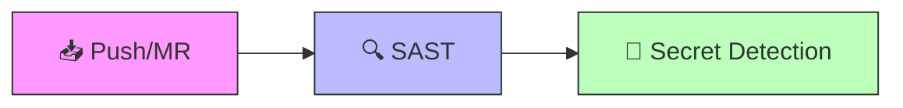
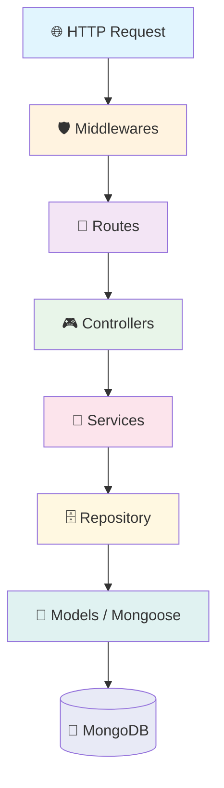

<div align="center">

# 🧾 RDV - Registro de Despesas de Viagens

**API RESTful para gerenciamento de despesas de viagens em transportadoras rodoviárias.**

Permite registrar viagens, despesas detalhadas por tipo (abastecimento, alimentação, pedágio, manutenção e outros) e gerenciar perfil de usuário.


</div>

---

## 📋 Sumário

- [Tecnologias](#-tecnologias)
- [Estrutura do Projeto](#-estrutura-do-projeto)
- [Instalação](#-instalação)
- [Variáveis de Ambiente](#-variáveis-de-ambiente)
- [Scripts npm](#-scripts-npm)
- [Docker](#-docker)
- [CI/CD](#-cicd)
- [Arquitetura da API](#-arquitetura-da-api)
- [Usando os Utilitários](#-usando-os-utilitários)
- [Convenções do Projeto](#-convenções-do-projeto)
- [Contribuindo](#-contribuindo)
- [Licença](#-licença)

---

## 🛠 Tecnologias

<details>
<summary><b>Backend</b></summary>

| Tecnologia | Versão | Descrição |
| :--- | :---: | :--- |
|  | 22+ | Runtime JavaScript (ES Modules) |
|  | 5.2 | Web framework |
|  | 8+ | Banco de dados NoSQL |
|  | 9 | ODM para MongoDB |
| `mongoose-paginate-v2` | 1.9 | Paginação automática |
|  | 9 | Autenticação com access/refresh/recovery tokens |
| `bcryptjs` | 3 | Hash seguro de senhas |

</details>

<details>
<summary><b>Segurança & Validação</b></summary>

| Tecnologia | Descrição |
| :--- | :--- |
|  | Headers HTTP de segurança com CSP |
| `cors` | Cross-Origin Resource Sharing |
| `express-rate-limit` | Rate limiting em 3 níveis (auth, strict, public) |
|  | Validação de schemas em runtime |
| `cpf-cnpj-validator` | Validação de documentos brasileiros (CPF/CNPJ) |
| `compression` | Compressão gzip de respostas |

</details>

<details>
<summary><b>Armazenamento</b></summary>

| Tecnologia | Descrição |
| :--- | :--- |
|  | Armazenamento S3-compatible de arquivos e imagens |
| `express-fileupload` | Upload de arquivos (limite 50MB) |
| `sharp` | Processamento e otimização de imagens |
| `multer` | Middleware de upload |

</details>

<details>
<summary><b>Monitoramento & Logging</b></summary>

| Tecnologia | Descrição |
| :--- | :--- |
|  | Logging estruturado com 3 transports (console, error file, combined file) |
| `winston-daily-rotate-file` | Rotação automática de logs diários (retenção de 30 dias) |

</details>

<details>
<summary><b>Testes</b></summary>

| Tecnologia | Descrição |
| :--- | :--- |
|  | Framework de testes com cobertura |
| `supertest` | Testes de integração HTTP |
| `mongodb-memory-server` | MongoDB em memória para testes isolados |
| `@faker-js/faker` | Geração de dados fake para testes e seeds |

</details>

<details>
<summary><b>Desenvolvimento</b></summary>

| Tecnologia | Descrição |
| :--- | :--- |
| `nodemon` | Auto-reload em desenvolvimento |
|  | Linting de código (flat config) |
|  | Formatação automática |
|  | Containerização (dev + prod) |
| `babel` | Transpilação de ES Modules para compatibilidade com Jest |

</details>

---

## 📁 Estrutura do Projeto

<details>
<summary><b>✅ Implementado</b> (clique para expandir)</summary>

```
tcc-despesas-api/
├── 📄 server.js                      # Ponto de entrada da aplicação
├── 📦 package.json                   # Dependências e scripts
├── 🐳 Dockerfile                     # Imagem Docker (node:22)
├── 🐳 docker-compose.yml             # Docker Compose de produção
├── 🐳 docker-compose.dev.yml         # Docker Compose de desenvolvimento
├── 🔄 .gitlab-ci.yml                 # Pipeline CI/CD (SAST + Secret Detection)
├── 🧪 jest.setup.js                  # Silencia console durante testes
├── ⚙️ nodemon.json                   # Configuração do hot-reload
├── ⚙️ eslint.config.js               # ESLint flat config (ES2024)
├── ⚙️ .prettierrc                    # Prettier para formatação
├── ⚙️ .prettierignore                # Arquivos ignorados pelo Prettier
├── ⚙️ .editorconfig                  # EditorConfig (2 espaços, LF, UTF-8)
├── ⚙️ .npmrc                         # Desabilita download automático do mongodb-memory-server
├── 🔐 .env.example                   # Exemplo de variáveis de ambiente
│
├── src/
│   ├── 🚀 app.js                     # Configuração Express com middlewares
│   │
│   ├── config/
│   │   ├── dbConnect.js               # Conexão com MongoDB (config por ambiente)
│   │   ├── garageConnect.js           # Cliente MinIO/Garage para armazenamento S3
│   │   └── setupGarage.js             # Inicialização do bucket no Garage
│   │
│   ├── middlewares/
│   │   ├── AuthMiddleware.js          # Autenticação JWT + verificação de refresh token
│   │   ├── RateLimitMiddleware.js     # Rate limiting em 3 níveis
│   │   ├── LogRoutesMiddleware.js     # Log de rotas (IP, método, URL)
│   │   └── asyncWrapper.js            # Wrapper para tratamento de erros async
│   │
│   └── utils/
│       ├── logger.js                  # Winston logger com rotação e limpeza automática
│       ├── AuthHelper.js              # Hash/comparação de senhas, tokens aleatórios
│       ├── TokenUtil.js               # Geração e decodificação de JWT (3 tipos)
│       │
│       ├── errors/
│       │   ├── AuthenticationError.js # Erro de autenticação (status 498)
│       │   └── TokenExpiredError.js   # Erro de token expirado (status 498)
│       │
│       ├── helpers/
│       │   ├── CommonResponse.js      # Respostas padronizadas { message, data, errors }
│       │   ├── CustomError.js         # Classe de erro operacional customizado
│       │   ├── HttpStatusCodes.js     # Constantes HTTP (mensagens em português)
│       │   ├── PermissionHelper.js    # Verificação de permissões (admin/dono)
│       │   ├── StatusService.js       # Resolução de mensagens por código/tipo
│       │   ├── errorHandler.js        # Middleware global de erros (12 tipos)
│       │   ├── messages.js            # Dicionário centralizado de mensagens (pt-BR)
│       │   ├── mongooseBrazilianDatePlugin.js  # Plugin de datas dd/MM/yyyy
│       │   └── index.js              # Barrel export de todos os helpers
│       │
│       └── validators/
│           └── schemas/zod/
│               ├── LoginSchema.js     # Validação de login (email + senha forte)
│               ├── ObjectIdSchema.js  # Validação de MongoDB ObjectId
│               ├── UsuarioSchema.js   # Validação de usuário (criação/atualização)
│               └── querys/
│                   ├── CommonQuerySchema.js   # Paginação e validação de ID
│                   └── UsuarioQuerySchema.js  # Filtros de busca de usuário
```

</details>

<details>
<summary><b>⏳ Em Desenvolvimento</b> (clique para expandir)</summary>

```
src/
├── 🎯 routes/                   # Express Routes
├── 🎮 controllers/              # Controllers
├── 💼 service/                  # Business Logic
├── 🗄️ repository/               # Data Access Layer
├── 📝 models/                   # Mongoose Models
├── 🌱 seeds/                    # Seeding de dados iniciais
├── 📚 docs/                     # Swagger documentation
└── 🧪 test/                     # Testes com Jest + Supertest
```

</details>

---

## 🚀 Instalação

### Requisitos

| Requisito | Versão |
| :--- | :--- |
|  | 22+ |
|  | 8+ |
|  | Recomendado |

### Setup Local

```bash
# Clonar o repositório
git clone https://gitlab.fslab.dev/tcc-registro-de-despesas-luis/tcc-despesas-api.git
cd tcc-despesas-api

# Instalar dependências
npm install

# Configurar variáveis de ambiente
cp .env.example .env
# Editar .env com suas configurações (importante: JWT_SECRET_*, GARAGE_*)
```

### Executar em Desenvolvimento

**Opção 1: Com Docker (recomendado)** 🐳
```bash
# Inicia MongoDB e a API com hot-reload via Docker Compose
npm run dev
```

**Opção 2: Localmente (sem Docker)**
```bash
# MongoDB deve estar rodando separadamente
npm run dev:local
```

### Executar em Produção

```bash
# Com Docker
npm run start

# Localmente (sem Docker)
npm run start:local
```

### Seeding de Dados

```bash
# Com Docker em execução
npm run seed

# Localmente (sem Docker)
npm run seed:local
```

### Testes

```bash
# Executar todos os testes com cobertura
npm test

# Executar teste específico
npx jest src/test/seu-teste.test.js
```

---

## 🔐 Variáveis de Ambiente

<details>
<summary><b>🗄️ Banco de Dados MongoDB</b></summary>

| Variável | Descrição | Exemplo |
| :--- | :--- | :--- |
| `DB_URL` | URL de conexão MongoDB | `mongodb://localhost:27017/appDespesas` |
| `DB_URL_TEST` | URL para testes | `mongodb://localhost:27017/appDespesas_teste` |
| `MONGO_SERVER_SELECTION_TIMEOUT_MS` | Timeout de seleção de servidor | `7000` |
| `MONGO_SOCKET_TIMEOUT_MS` | Timeout de socket | `45000` |
| `MONGO_CONNECT_TIMEOUT_MS` | Timeout de conexão | `10000` |
| `MONGO_MAX_POOL_SIZE` | Tamanho máximo do pool de conexões | `10` |

</details>

<details>
<summary><b>⚙️ Aplicação</b></summary>

| Variável | Descrição | Padrão |
| :--- | :--- | :--- |
| `API_PORT` | Porta da API | `3000` |
| `NODE_ENV` | Ambiente (development/production) | `development` |
| `DEBUGLOG` | Ativar logs de debug de rotas | `true` |
| `SALT_LENGTH` | Rounds do bcrypt para hash de senha | `10` |

</details>

<details>
<summary><b>🔑 JWT (Autenticação)</b></summary>

| Variável | Descrição | Padrão |
| :--- | :--- | :--- |
| `JWT_SECRET_ACCESS_TOKEN` | Segredo do access token | *(mínimo 32 caracteres)* |
| `JWT_SECRET_REFRESH_TOKEN` | Segredo do refresh token | *(mínimo 32 caracteres)* |
| `JWT_SECRET_PASSWORD_RECOVERY` | Segredo do token de recuperação | *(mínimo 32 caracteres)* |
| `JWT_ACCESS_TOKEN_EXPIRATION` | Expiração do access token | `2m` |
| `JWT_REFRESH_TOKEN_EXPIRATION` | Expiração do refresh token | `3d` |
| `JWT_PASSWORD_RECOVERY_EXPIRATION` | Expiração do recovery token | `1h` |
| `SINGLE_SESSION_REFRESH_TOKEN` | Apenas 1 refresh por login | `false` |

</details>

<details>
<summary><b>☁️ Garage/MinIO (Armazenamento S3)</b></summary>

| Variável | Descrição | Exemplo |
| :--- | :--- | :--- |
| `GARAGE_ENDPOINT` | Endpoint do servidor (sem protocolo) | `localhost` |
| `GARAGE_PORT` | Porta do Garage | `9000` |
| `GARAGE_USE_SSL` | Usar SSL (true/false) | `false` |
| `GARAGE_PUBLIC_URL` | URL pública para acessar imagens | `http://localhost:9000` |
| `GARAGE_ACCESS_KEY` | Chave de acesso | *(obrigatório)* |
| `GARAGE_SECRET_KEY` | Chave secreta | *(obrigatório)* |
| `GARAGE_BUCKET_FOTOS` | Nome do bucket para fotos | *(obrigatório)* |

</details>

<details>
<summary><b>📊 Logging</b></summary>

| Variável | Descrição | Padrão |
| :--- | :--- | :--- |
| `LOG_ENABLED` | Habilitar sistema de logs | `true` |
| `LOG_LEVEL` | Nível mínimo de log | `info` |
| `LOG_MAX_SIZE_GB` | Tamanho máximo total dos logs (GB) | `50` |

</details>

<details>
<summary><b>📚 Swagger</b></summary>

| Variável | Descrição | Exemplo |
| :--- | :--- | :--- |
| `SWAGGER_DEV_URL` | URL base em desenvolvimento | `http://localhost:3000/` |
| `SWAGGER_PROD_URL` | URL base em produção | `http://localhost:3000/prod` |

</details>

---

## 📜 Scripts npm

| Script | Comando | Descrição |
| :--- | :--- | :--- |
| `dev` | `docker compose -f docker-compose.dev.yml up --build --force-recreate` | 🐳 Dev com Docker (MongoDB + API + hot-reload) |
| `dev:local` | `npx nodemon server.js` | 💻 Dev local com auto-reload |
| `start` | `docker compose -f docker-compose.yml up --build` | 🐳 Produção com Docker |
| `start:local` | `node server.js` | 💻 Produção local sem Docker |
| `seed` | `docker exec -it api-despesas node src/seeds/seeds.js` | 🌱 Popula dados iniciais (Docker) |
| `seed:local` | `node src/seeds/seeds.js` | 🌱 Popula dados iniciais (local) |
| `test` | `jest --coverage --detectOpenHandles` | 🧪 Executa testes com cobertura |
| `lint` | `eslint .` | 🔍 Verifica linting |
| `lint:fix` | `eslint . --fix` | 🔧 Corrige problemas de linting |
| `format` | `prettier --write .` | ✨ Formata código com Prettier |
| `format:check` | `prettier --check .` | 🔍 Verifica formatação sem alterar |

---

## 🐳 Docker

### Produção (`docker-compose.yml`)

Dois serviços na rede `despesas-network`:

| Serviço | Imagem | Porta | Detalhes |
| :--- | :--- | :---: | :--- |
| `mongodb-despesas` | `mongo:8` | `27018:27017` | Healthcheck + volume persistente |
| `api-despesas` | Build local | `5040:5040` | restart: `unless-stopped` |

```bash
npm run start
```

### Desenvolvimento (`docker-compose.dev.yml`)

Mesmo setup com diferenças:
- 📂 Código-fonte montado como volume (hot-reload com nodemon)
- `NODE_ENV=development`
- 🔇 Logs do MongoDB desabilitados

```bash
npm run dev
```

---

## 🔄 CI/CD

Pipeline GitLab CI (`.gitlab-ci.yml`) com dois estágios de segurança:



| Estágio | Descrição |
| :--- | :--- |
| `test` | 🔍 SAST - análise estática de segurança do código |
| `secret-detection` | 🔐 Detecção de credenciais/segredos commitados |

---

## 🏗 Arquitetura da API

### Padrão em Camadas



> ⚠️ Atualmente, apenas as camadas de **Middlewares** e **Utils** estão implementadas. As camadas de Routes, Controllers, Services, Repository e Models estão em desenvolvimento.

### Cadeia de Middlewares

```
 ┌─────────────────────────────────────────────────────────────┐
 │  1. 🛡️  helmet()              → Headers de segurança + CSP  │
 │  2. 🌐  cors()                → Cross-origin access         │
 │  3. 📦  compression()         → Compressão gzip             │
 │  4. 📋  express.json()        → Parse de body JSON          │
 │  5. 📎  expressFileUpload()   → Upload de arquivos (50MB)   │
 │  6. 🔀  trust proxy           → IP correto atrás de proxy   │
 │  7. 📝  express.urlencoded()  → Parse de form data          │
 │  8. 📂  static /public        → Arquivos estáticos          │
 │  9. 🎯  routes(app)           → Rotas da aplicação          │
 │ 10. ❓  404 handler           → Rotas não encontradas       │
 │ 11. 🚨  errorHandler          → Tratamento global de erros  │
 └─────────────────────────────────────────────────────────────┘
```

### 🔒 Autenticação JWT (3 tokens)

| Token | Secret | Expiração | Uso |
| :--- | :--- | :---: | :--- |
| 🟢 Access Token | `JWT_SECRET_ACCESS_TOKEN` | 2 min | Acesso à API |
| 🔵 Refresh Token | `JWT_SECRET_REFRESH_TOKEN` | 3 dias | Renovação do access token |
| 🟡 Recovery Token | `JWT_SECRET_PASSWORD_RECOVERY` | 1 hora | Recuperação de senha |

> O `AuthMiddleware` verifica o access token **e** confirma a existência do refresh token no banco (dupla validação), permitindo invalidação server-side de sessões.

### 🚦 Rate Limiting (3 níveis)

| Nível | Janela | Max Req | Uso |
| :--- | :---: | :---: | :--- |
| `authRateLimit` | 15 min | 100 | Rotas autenticadas |
| `strictRateLimit` | 5 min | 50 | Operações sensíveis (login) |
| `publicRateLimit` | 15 min | 100 | Endpoints públicos |

### 🚨 Tratamento de Erros

O `errorHandler` trata **12 tipos de erros** distintos com respostas padronizadas:

| Tipo de Erro | Status | Descrição |
| :--- | :---: | :--- |
| `ZodError` | `400` | Validação de schema falhou |
| MongoDB duplicate key (11000) | `409` | Campo com valor duplicado |
| Mongoose `ValidationError` | `400` | Validação de modelo |
| `AuthenticationError` | `498` | Falha de autenticação |
| `TokenExpiredError` | `498` | Token expirado |
| `CustomError` (tokenExpired) | `401` | Token expirado (operacional) |
| Mongoose `CastError` | `400` | Valor inválido para campo |
| `BSONError` / `BSONTypeError` | `400` | Formato de identificador inválido |
| Mongoose `StrictModeError` | `400` | Campo não permitido |
| `SyntaxError` (JSON) | `400` | JSON malformado |
| `TypeError` | `400` | Erro de tipo (UUID em produção) |
| Erros não tratados | `500` | Erro interno (UUID para rastreabilidade) |

> Todos os erros recebem um `errorId` (UUID) para rastreabilidade nos logs.

### 📤 Resposta Padronizada

Todas as respostas seguem o formato:

```json
{
  "message": "Mensagem descritiva",
  "data": { "..." },
  "errors": [{ "path": "campo", "message": "detalhe" }]
}
```

---

## 💡 Usando os Utilitários

<details>
<summary><b>📤 CommonResponse</b></summary>

```javascript
import { CommonResponse } from './utils/helpers/index.js';

CommonResponse.success(res, data, 200, 'Operação realizada');
CommonResponse.created(res, data, 'Recurso criado');
CommonResponse.error(res, 400, 'validationError', 'campo', errors);
CommonResponse.serverError(res, 'Erro interno');
```

</details>

<details>
<summary><b>✅ Validação com Zod</b></summary>

```javascript
import { LoginSchema } from './utils/validators/schemas/zod/LoginSchema.js';
import { UsuarioSchema, UsuarioUpdateSchema } from './utils/validators/schemas/zod/UsuarioSchema.js';
import { PaginationQuerySchema } from './utils/validators/schemas/zod/querys/CommonQuerySchema.js';

const loginData = LoginSchema.parse(req.body);
const userData = UsuarioSchema.parse(req.body);
const updateData = UsuarioUpdateSchema.parse(req.body);
const query = PaginationQuerySchema.parse(req.query);
```

</details>

<details>
<summary><b>🔑 Autenticação</b></summary>

```javascript
import AuthMiddleware from './middlewares/AuthMiddleware.js';
import TokenUtil from './utils/TokenUtil.js';
import AuthHelper from './utils/AuthHelper.js';

// Proteger rota
router.get('/rota', AuthMiddleware, callback);

// Gerar tokens
const accessToken = TokenUtil.generateAccessToken(userId);
const refreshToken = TokenUtil.generateRefreshToken(userId);

// Hash de senha
const hash = await AuthHelper.hashPassword(senha);
const isValid = await AuthHelper.comparePassword(senha, hash);
```

</details>

<details>
<summary><b>📊 Logger</b></summary>

```javascript
import logger from './utils/logger.js';

logger.info('Mensagem informativa');
logger.error('Erro da aplicação', { errorId, stack });
logger.warn('Aviso importante');
```

</details>

<details>
<summary><b>🚨 Tratamento de Erros Customizado</b></summary>

```javascript
import { CustomError, HttpStatusCodes } from './utils/helpers/index.js';

throw new CustomError({
  statusCode: HttpStatusCodes.NOT_FOUND.code,
  errorType: 'resourceNotFound',
  field: 'usuario',
  details: [{ message: 'Usuário não encontrado' }],
});
```

</details>

<details>
<summary><b>🔐 Verificação de Permissão</b></summary>

```javascript
import { ensurePermission } from './utils/helpers/index.js';

ensurePermission({
  usuarioLogado: req.user,
  targetId: req.params.id,
  field: 'usuario',
});
```

</details>

---

## 📏 Convenções do Projeto

| Convenção | Padrão |
| :--- | :--- |
| **Variáveis JS** | `camelCase` |
| **Variáveis de ambiente** | `UPPER_CASE` |
| **Arquivos (classes)** | `PascalCase.js` |
| **Arquivos (utils/helpers)** | `camelCase.js` |
| **Respostas da API** | Sempre via `CommonResponse` |
| **Validação de input** | Sempre com Zod antes de processar |
| **Erros operacionais** | Sempre via `CustomError` |
| **Logging** | Sempre via Winston logger |
| **Rotas async** | Sempre com `asyncWrapper` |

---

## 📄 Licença

Este projeto está licenciado sob a **MIT License** - veja o arquivo [LICENSE](LICENSE) para detalhes.

---

<div align="center">

Desenvolvido por **Luis Felipe Lopes**


</div>
